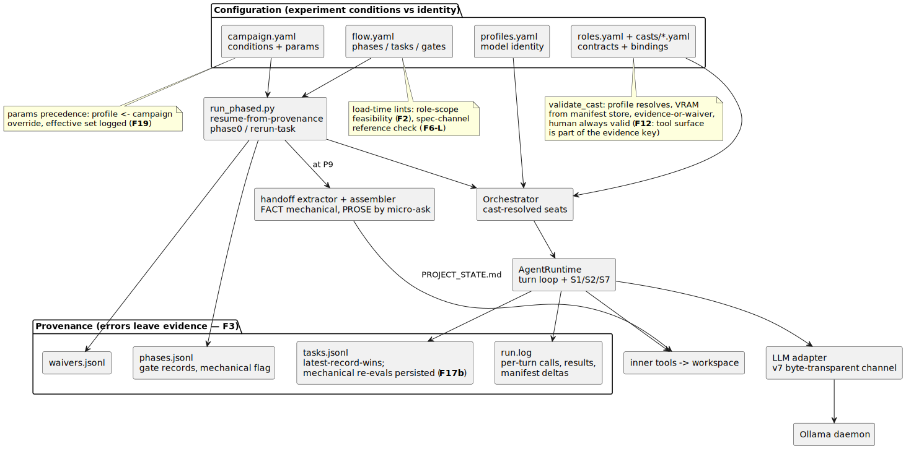
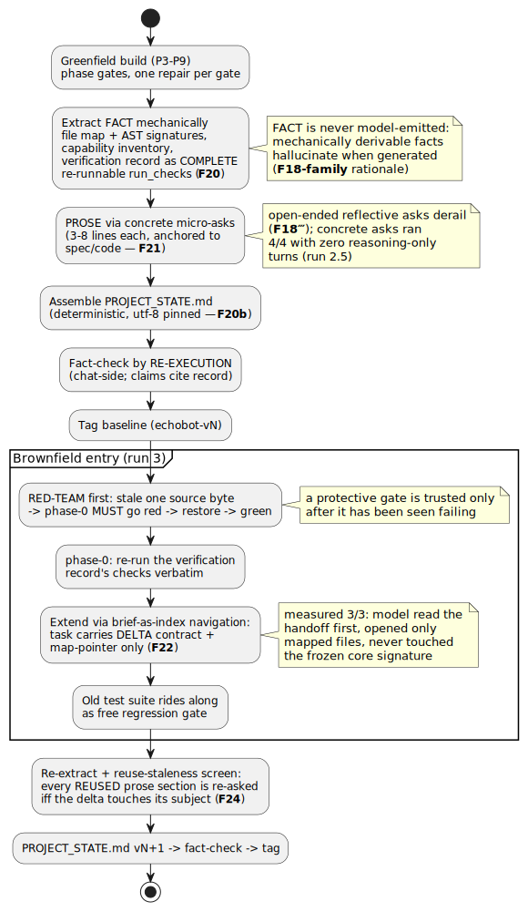
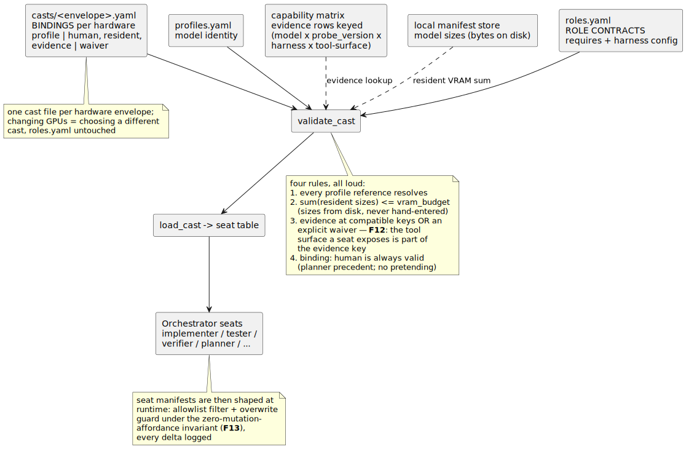
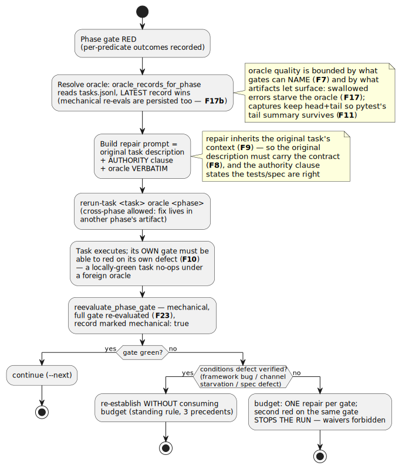

# Architecture diagrams

Rendered views of how Agora actually runs. Each diagram is a small PlantUML
source (`*.puml`) checked in beside its rendered `*.svg`; the **source of truth is
always the code** the diagram cites, and every constraint on a diagram carries the
finding number that put it there (`F#` / `S#` / probe `v#`, indexed in
[`docs/runs/integration-run-1/findings.md`](../runs/integration-run-1/findings.md)
and narrated in [`docs/arc/arc.md`](../arc/arc.md)).

**Rendering.** `scripts/render_diagrams.py` re-renders every `*.puml` in this
directory to a sibling `*.svg` via the local PlantUML server
(`plantuml-server` container, `http://localhost:18080`). It is standalone
(stdlib only) and exits loudly if the server is down, so a stale diagram can't
pass silently:

```bash
python scripts/render_diagrams.py
```

The set is five diagrams, all rendered below. Each is captioned with the findings
its constraints encode and the code that is its source of truth.

## 1. System dataflow



The whole run as three regions. **Configuration** separates experiment CONDITIONS
from model IDENTITY: `campaign.yaml` params override `profiles.yaml` with the
effective set logged (**F19**); `flow.yaml` carries phases/tasks/gates and passes
two load-time lints — role-scope feasibility (**F2**) and the spec-channel
reference check (**F6**); `casts/*.yaml` bind roles to profiles under
`validate_cast` (profile resolves, VRAM summed from the manifest store,
evidence-or-waiver, human always valid — **F12**, the tool surface is part of the
evidence key). **Execution** flows `run_phased.py` (resumable from provenance;
`--phase0` / `--rerun-task`) → orchestrator → `AgentRuntime` (the S1/S2/S7 turn
loop) → the **v7 byte-transparent** adapter → Ollama, with inner tools writing the
workspace and the handoff extractor assembling PROJECT_STATE.md at P9.
**Provenance** is the invariant that makes the rest auditable — every runner writes
run.log, tasks.jsonl (latest-record-wins, mechanical re-evals persisted — **F17b**),
phases.jsonl, and waivers.jsonl, because *errors must leave evidence* (**F3**).
Source of truth: [`scripts/run_phased.py`](../../scripts/run_phased.py),
[`src/agora/fleet/`](../../src/agora/fleet/), [`src/agora/plan/`](../../src/agora/plan/).

## 2. The tool-call turn


One iteration of `AgentRuntime._run_loop` end to end — the hot path where most of
the program's findings live. The runtime shapes the seat's tool manifest
(allowlist filter, the `write_file` overwrite guard that may never leave zero
mutation tools — **F13**, every change logged), hands messages + manifest to the
**v7 byte-transparent** LLM adapter (tool results delivered verbatim, so the model
copies exactly what it is shown), and then branches: a turn with tool calls goes
through `validate_call` (**S1** corrective errors — the model sees a schema echo,
never a raw traceback; role scope enforced here and at the load-time lint,
**F1/F2**) to dispatch and back; an empty or reasoning-only turn is met by the
scoped recovery levers (**S2** nudge for stalls, **S7** salvage for reasoning-only
turns — both powerless over a turn the model has decided to terminate, **F18‴**).
Every call, result, nudge, salvage, and `run_check` capture is written to
provenance (**F3**: the observer is always attached; **F11**: head+tail capture).
Source of truth: [`src/agora/fleet/agent_runtime.py`](../../src/agora/fleet/agent_runtime.py),
[`inner_tools.py`](../../src/agora/fleet/inner_tools.py),
[`llm_adapter.py`](../../src/agora/fleet/llm_adapter.py).

## 3. Handoff lifecycle



The full greenfield → handoff → brownfield → re-handoff arc. After a build behind
phase gates, the handoff document is assembled in two halves: **FACT** sections
(file map + AST signatures, capability inventory, the verification record as
COMPLETE re-runnable `run_check`s — **F20**) are generated MECHANICALLY, never
model-emitted, because facts that can be derived hallucinate when a model writes
them (the **F18-family** rationale); **PROSE** sections come from concrete,
spec/code-anchored micro-asks (**F21**), because the open-ended reflective ask
derails (**F18‴**) while the concrete ones ran 4/4 with zero reasoning-only turns.
The pieces assemble deterministically, utf-8 pinned (**F20b**), and are fact-checked
by RE-EXECUTION before the baseline is tagged. Brownfield entry RED-TEAMS the
protective gate first (stale one byte → phase-0 must go red → restore → green: a
gate is trusted only once it has been seen failing), re-runs the record verbatim,
then extends via **brief-as-index navigation** — the task carries only a delta
contract + a map-pointer (**F22**), and the model was measured 3/3 reading the
handoff first and never touching the frozen core. Re-handoff screens every REUSED
prose section for staleness against the delta (**F24**). Source of truth:
[`src/agora/plan/handoff.py`](../../src/agora/plan/handoff.py),
`run_phased.py --phase0`.

## 4. Roles & casting



How a seat gets a model — or a human. `roles.yaml` holds role CONTRACTS (what a
role requires + its harness config); `casts/<envelope>.yaml` binds each role, per
hardware envelope, to a profile-or-human with residency + evidence/waiver;
`profiles.yaml` is model identity. `validate_cast` enforces four loud rules: every
profile reference resolves; the resident sizes sum within `vram_budget` (sizes read
from the on-disk manifest store, never hand-entered); each binding cites evidence at
a COMPATIBLE key or an explicit waiver — **F12**, the tool surface a seat exposes is
part of the evidence key, so a 9/9 on one tool family does not license casting onto
another; and `binding: human` is always valid (the planner precedent — no pretending
a human seat is a model). One cast file per envelope means changing GPUs is choosing
a different cast, `roles.yaml` untouched. The resolved seats' manifests are then
shaped at runtime — allowlist filter + the overwrite guard under the
zero-mutation-affordance invariant (**F13**), every delta logged. Source of truth:
[`src/agora/fleet/cast.py`](../../src/agora/fleet/cast.py), `roles.yaml`, `casts/`.

## 5. Repair / oracle loop



How a red gate becomes a fix. The oracle is resolved from tasks.jsonl by
`oracle_records_for_phase` (latest record wins, mechanical re-evals included —
**F17b**); its quality is bounded by what gates can NAME (**F7**) and by what the
artifacts surface — swallowed errors starve it (**F17**), so captures keep head+tail
and pytest's tail summary survives (**F11**). The repair prompt is the original task
description + an AUTHORITY clause + the oracle VERBATIM: because repair inherits the
original task's context (**F9**), that description must already carry the contract
(**F8**). `--rerun-task <task> --oracle <phase>` runs it (cross-phase allowed — the
fix may live in another phase's artifact); the task's OWN gate must be able to red on
its own defect or it no-ops under a foreign oracle (**F10**); and
`reevaluate_phase_gate` re-checks the FULL gate mechanically (**F23**), marking the
record `mechanical: true`. If it is still red, the standing rules decide: a VERIFIED
conditions defect (framework bug / channel starvation / spec defect) re-establishes
WITHOUT consuming budget (three precedents); otherwise the budget is ONE repair per
gate — a second red on the same gate STOPS the run, waivers forbidden. Source of
truth: [`scripts/run_phased.py`](../../scripts/run_phased.py) (`reevaluate_phase_gate`,
`oracle_records_for_phase`, `build_repair_description`),
[`docs/integration/repair-task-template.md`](../integration/repair-task-template.md).
