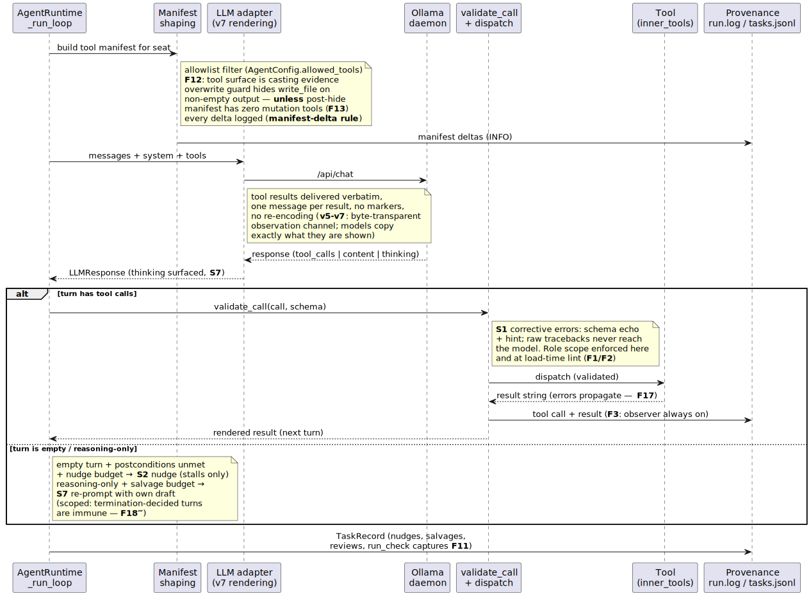

# Architecture diagrams

Rendered views of how Agora actually runs. Each diagram is a small PlantUML
source (`*.puml`) checked in beside its rendered `*.svg`; the **source of truth is
always the code** the diagram cites, and every constraint on a diagram carries the
finding number that put it there (`F#` / `S#` / probe `v#`, indexed in
[`docs/runs/integration-run-1/findings.md`](../runs/integration-run-1/findings.md)
and narrated in [`docs/arc/arc.md`](../arc/arc.md)).

**Rendering.** `scripts/render_diagrams.py` re-renders every `*.puml` in this
directory to a sibling `*.svg` via the local PlantUML server
(`plantuml-server` container, `http://localhost:18080`). It is standalone
(stdlib only) and exits loudly if the server is down, so a stale diagram can't
pass silently:

```bash
python scripts/render_diagrams.py
```

The set is five diagrams. Diagram 2 (the tool-call turn) is the committed
exemplar below; the other four are authored alongside it and render the same way.

## 1. System dataflow

Top-level: flow YAML → cast/profile resolution → orchestrator → phase gates →
provenance. _(Source authored separately; run `render_diagrams.py` once
`system_dataflow.puml` lands.)_

## 2. The tool-call turn



One iteration of `AgentRuntime._run_loop` end to end — the hot path where most of
the program's findings live. The runtime shapes the seat's tool manifest
(allowlist filter, the `write_file` overwrite guard that may never leave zero
mutation tools — **F13**, every change logged), hands messages + manifest to the
**v7 byte-transparent** LLM adapter (tool results delivered verbatim, so the model
copies exactly what it is shown), and then branches: a turn with tool calls goes
through `validate_call` (**S1** corrective errors — the model sees a schema echo,
never a raw traceback; role scope enforced here and at the load-time lint,
**F1/F2**) to dispatch and back; an empty or reasoning-only turn is met by the
scoped recovery levers (**S2** nudge for stalls, **S7** salvage for reasoning-only
turns — both powerless over a turn the model has decided to terminate, **F18‴**).
Every call, result, nudge, salvage, and `run_check` capture is written to
provenance (**F3**: the observer is always attached; **F11**: head+tail capture).
Source of truth: [`src/agora/fleet/agent_runtime.py`](../../src/agora/fleet/agent_runtime.py),
[`inner_tools.py`](../../src/agora/fleet/inner_tools.py),
[`llm_adapter.py`](../../src/agora/fleet/llm_adapter.py).

## 3. Handoff lifecycle

PROJECT_STATE.md assembly (mechanical FACT + concrete-ask PROSE), fact-check, and
phase-0 re-validation — the F18‴/F20/F21/F24 doctrine. _(Source authored
separately.)_

## 4. Roles & casting

Role → profile binding under a hardware envelope, with the per-(model × tool
surface) evidence key (F12) and the write-scope rules (F1/F2). _(Source authored
separately.)_

## 5. Repair / oracle loop

The cross- and same-phase repair path: red gate → verbatim oracle → one repair →
mechanical full-gate re-eval (F7/F9/F17b/F23), with the standing budget rules.
_(Source authored separately.)_
